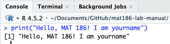

<div id="password-gate" style="background: #f8f9fa; padding: 20px; border: 1px solid #dee2e6; border-radius: 5px; text-align: center;">
  <h3>🔒 Solutions Protected</h3>
  <p>Please enter the classroom code to unlock Lab 1 results.</p>
  <input type="password" id="pass-input" style="padding: 5px;" placeholder="Enter password...">
  <button onclick="checkPassword()" style="padding: 5px 15px; background: #007bff; color: white; border: none; border-radius: 3px; cursor: pointer;">Unlock</button>
</div>

<div id="solution-content" style="display:none;">

# Lab01-solution
```{r}
#| label: fig-lab01-sol
#| fig-cap: "The code: print('Hello, MAT 186!')"
#| out-width: "100%"


```

<script>
function checkPassword() {
  // Change "pass" to "pass-input" to match your HTML
  var userPass = document.getElementById("pass-input").value; 
  
  if (userPass === "MAT186") { 
    document.getElementById("password-gate").style.display = "none";
    document.getElementById("solution-content").style.display = "block";
  } else {
    alert("Incorrect Password");
  }
}
</script>


***

::: {.content-block}
<center>
<a href="../solutions.html" class="btn btn-primary btn-lg" role="button">🏠 Back to Solutions Hub</a>
</center>
:::


