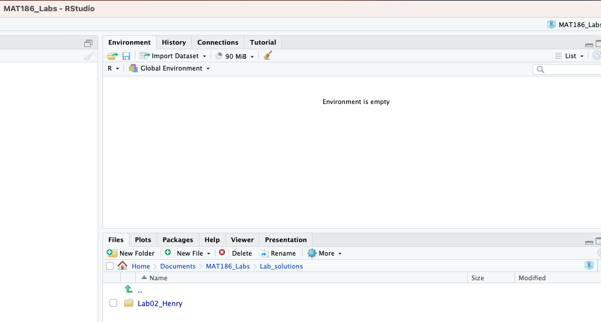

<div id="password-gate" style="background: #f8f9fa; padding: 20px; border: 1px solid #dee2e6; border-radius: 5px; text-align: center;">
  <h3>🔒 Solutions Protected</h3>
  <p>Please enter the classroom code to unlock Lab results.</p>
  <input type="password" id="pass-input" style="padding: 5px;" placeholder="Enter password...">
  <button onclick="checkPassword()" style="padding: 5px 15px; background: #007bff; color: white; border: none; border-radius: 3px; cursor: pointer;">Unlock</button>
</div>

<div id="solution-content" style="display:none;">


## Lab 2 Official Solutions

### Lab Task 1: Setting Up Your Workspace
```{r,echo=FALSE}
#| label: fig-rstudio-setup
#| fig-cap: "**screenshot** 1. Project name (MAT186_Labs) in the top-right. 2. Data and Images folders in the Files pane. 3. Your named lab folder nested inside Lab_solutions."
#| out-width: "100%"
#| fig-align: "center"


```


### Task 2: Basic Arithmetic
The student was asked to create a code chunk that calculates $2 + 2$.

```{r}
#| echo: true
2 + 2
```
<br><br>

</div>

<script>
function checkPassword() {
var userPass = document.getElementById("pass-input").value;

// This uses the LAB_PASSWORD from your security.js file
if (userPass === LAB_PASSWORD) {
document.getElementById("password-gate").style.display = "none";
document.getElementById("solution-content").style.display = "block";
} else {
alert("Incorrect password. Please try again.");
}
}

// Allow "Enter" key to trigger the button
document.getElementById("pass-input").addEventListener("keypress", function(event) {
if (event.key === "Enter") {
checkPassword();
}
});
</script>


***

::: {.content-block}
<center>
<a href="../solutions.html" class="btn btn-primary btn-lg" role="button">🏠 Back to Solutions Hub</a>
</center>
:::

